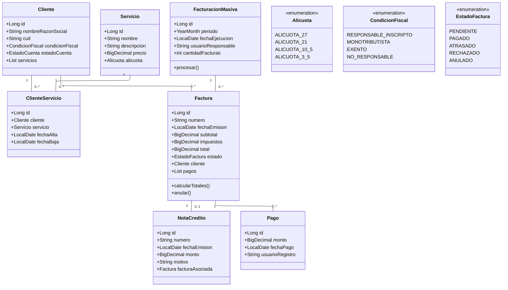
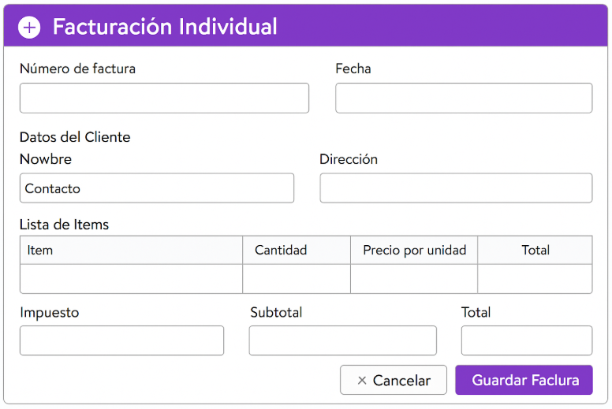
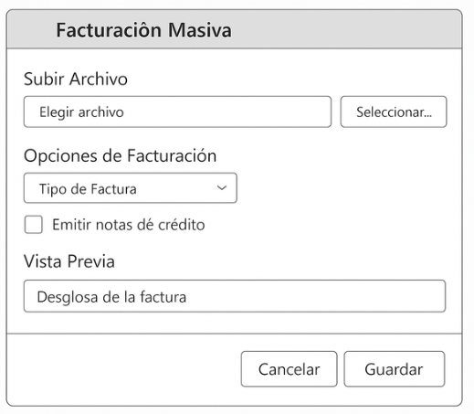
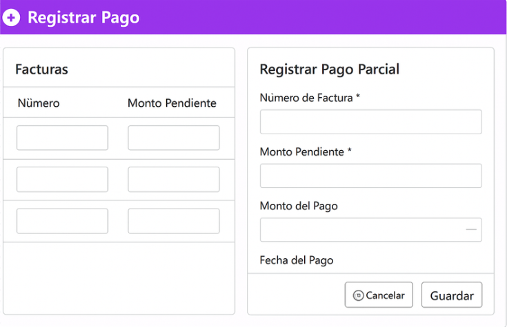

# Trabajo en equipo

| Integrante              | Tareas realizadas en la Iteración 2 |
|------------------------|--------------------------------------|
| **Antúnez, Elías**     | Facturación Individual (HU-08), generación de PDF, numeración de facturas y ajustes en la interfaz de emisión. |
| **Savallich, Milagros**| Facturación Masiva (HU-07), registro de responsable y período, y anulación de facturas con Nota de Crédito (HU-09). |
| **Donda, Melisa**      | Registro de pagos totales (HU-11), pagos parciales (HU-12), actualización de saldos y estados de cuenta en la interfaz de pagos. |

---

# Diseño OO (Modelo para esta iteración)

---

# Wireframe y Caso de Uso

### Wireframes tentativos:

> **Facturación Individual**

> **Facturación Masiva**

> **Anulación de Factura**

> **Registrar Pago (total / parcial)**

---

### Casos de Uso incluidos en esta iteración

#### CU – Facturación Masiva (HU-07)

1. Admin selecciona período (ej: Marzo 2025)
2. Sistema calcula qué clientes activos tienen servicios asignados
3. Se generan todas las facturas
4. Se registra usuario responsable y fecha
5. Sistema muestra resumen del lote procesado

#### CU – Facturación Individual (HU-08)

1. Admin selecciona cliente y servicio(s)
2. Sistema calcula impuestos y total
3. Se asigna número único y secuencial
4. Permite descargar PDF e imprime si se requiere

#### CU – Anulación de Factura (HU-09)

1. Admin elige factura emitida
2. Ingresa motivo
3. Sistema crea Nota de Crédito y vincula los documentos

#### CU – Registrar Pago Total (HU-11)

1. Seleccionar factura pendiente
2. Sistema muestra saldo total
3. Admin confirma pago → queda **PAGADA**

#### CU – Registrar Pago Parcial (HU-12)

1. Seleccionar factura con saldo pendiente
2. Admin ingresa monto parcial
3. Sistema recalcula saldo → si llega a 0, factura pasa a **PAGADA**

---

# Backlog de Iteración 2

| HU    | Nombre                 | Objetivo                                        |
| ----- | ---------------------- | ----------------------------------------------- |
| HU-07 | Facturación Masiva     | Emitir facturas para todos los clientes activos |
| HU-08 | Facturación Individual | Emitir una factura manual para un cliente       |
| HU-09 | Anulación de Facturas  | Emitir nota de crédito asociada                 |
| HU-11 | Registrar Pago Total   | Marcar factura como pagada completamente        |
| HU-12 | Registrar Pago Parcial | Registrar pagos parciales con saldo pendiente   |

---

# Tareas

### Facturación Individual (HU-08)

* [ ] Generar numeración secuencial
* [ ] Cálculo de impuestos y total
* [ ] Guardado de factura y detalles
* [ ] Generación PDF
* [ ] Registro de usuario emisor

### Facturación Masiva (HU-07)

* [ ] Selección de período
* [ ] Buscar clientes activos con servicios asignados
* [ ] Generación de lote de facturas
* [ ] Registro de logs (fecha, responsable, cantidad emitida)

### Anulación de Factura (HU-09)

* [ ] Validar factura emitida y no pagada completamente
* [ ] Crear nota de crédito
* [ ] Asociar factura ↔ nota crédito
* [ ] Marcar estado como ANULADA

### Pago Total (HU-11)

* [ ] Validar estado de factura
* [ ] Registrar pago con usuario y fecha
* [ ] Actualizar estado a PAGADA

### Pago Parcial (HU-12)

* [ ] Validar que el monto no supere saldo pendiente
* [ ] Registrar pago
* [ ] Recalcular saldo y actualizar estado si corresponde

